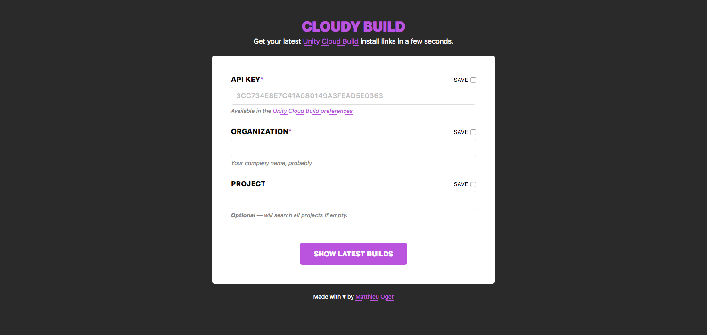

# Cloudy Build

> Fast UI for Unity Cloud Build.
>
> [cloudy-build.pxn.io](https://cloudy-build.pxn.io/)

# 

## TODO

- [ ] Change API Key field to a password field?
- [ ] Do not regenerate a link everytime. We should first check with a `GET` on `share`, then `POST` if no link is created, or offer an option for regeneration (the Unity Cloud Build API is not great…).
- [ ] Add [Jest](https://jestjs.io/) and "tests, tests, tests". 😅
- [ ] Add [Husky](https://www.npmjs.com/package/husky) to trigger `yarn test` before a `push`.
- [ ] Add [CI](https://travis-ci.org/).
- [ ] Improve aesthetics. It's a quick design I made one year or two ago, and it could be way better. Including the favicon. And animations.
- [ ] Remove TypeScript? It was the first time I used TypeScript, and even if I like it and see the advantages, I just don't use it well or sufficiently enough in this project. The part where it could be really nice is the server, and I use plain old JS there.
